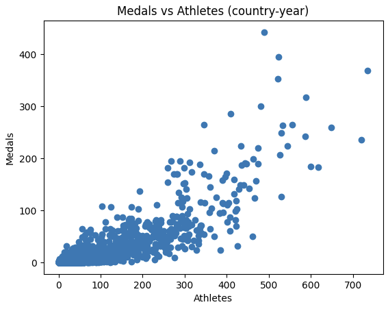

# 🥇 Olympic Medal Predictor

A machine learning project that predicts how many medals a country will win at the Olympics based on historical participation and performance.
The system uses past Olympic data to engineer country-level features such as number of athletes and medals from the previous Games, then trains a regression model to estimate medal counts. The entire pipeline is automated, reproducible, and version-controlled, from raw data ingestion to a CLI prediction tool.

This is not just a notebook project. It is a complete ML pipeline with data processing, model training, evaluation, and deployment-style inference.

---

## 🚀 Tech Stack

* **Python**
* **Pandas, NumPy** – data cleaning & feature engineering
* **scikit-learn** – model training (Ridge Regression)
* **Matplotlib** – visualization
* **Joblib** – model serialization
* **Jupyter Notebook** – EDA
* **Git & GitHub** – version control
* **VS Code** – development environment

---

## 📂 Dataset

Dataset:
**120 years of Olympic history: athletes and results** (Kaggle – heesoo37)

Raw files are not committed to Git. They are downloaded locally using KaggleHub.

Expected files:

```
data/raw/athlete_events.csv
data/raw/noc_regions.csv
```

Download:

```bash
pip install kagglehub
python download_dataset.py
```

---

## ⚙️ How to Run

From the project root:

1. Create clean dataset:

```bash
python -m src.make_dataset
```

2. Train the model:

```bash
python -m src.train --test_year 2016
```

3. Evaluate performance:

```bash
python -m src.evaluate
```

4. Make a prediction (CLI tool):

```bash
python -m src.predict --country "Canada" --athletes 315 --prev_medals 24
```

---

## 📊 Results

Model performance is evaluated using **Mean Absolute Error (MAE)** on a time-based holdout year.

Example:

```
Test Year: 2016  
MAE: ~X.XX medals
```

This means that on average, predictions are within about **X medals** of the real outcome per country.




---

## 🗂 Project Structure

```
olympic-medal-predictor/
│
├── data/
│   ├── raw/            # Raw datasets (ignored by Git)
│   └── processed/      # Clean dataset generated by pipeline
│
├── notebooks/
│   └── 01_eda.ipynb    # Exploratory data analysis
│
├── src/
│   ├── __init__.py
│   ├── config.py       # Centralized paths
│   ├── make_dataset.py# Data processing pipeline
│   ├── train.py        # Model training
│   ├── evaluate.py     # Evaluation + MAE
│   └── predict.py      # CLI prediction tool
│
├── models/             # Saved models (ignored by Git)
├── download_dataset.py
├── requirements.txt
├── .gitignore
└── README.md
```

---

## 🔮 Future Improvements

* Add more features:

  * GDP, population, host country advantage
  * Sports-specific performance trends

* Try stronger models:

  * Random Forest
  * Gradient Boosting (XGBoost/LightGBM)

* Hyperparameter tuning with cross-validation

* Turn the CLI into:

  * A small web app (Flask / FastAPI)
  * Or a dashboard

* Add experiment tracking (MLflow)


