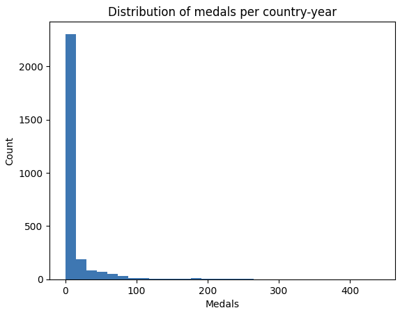

## Dataset

This project uses the Kaggle dataset:
**120 years of Olympic history: athletes and results**
by heesoo37.

The dataset is downloaded using the KaggleHub Python API.

Files are expected at:
- data/raw/athlete_events.csv
- data/raw/noc_regions.csv

To download the dataset locally:

```bash
pip install kagglehub
python download_dataset.py

